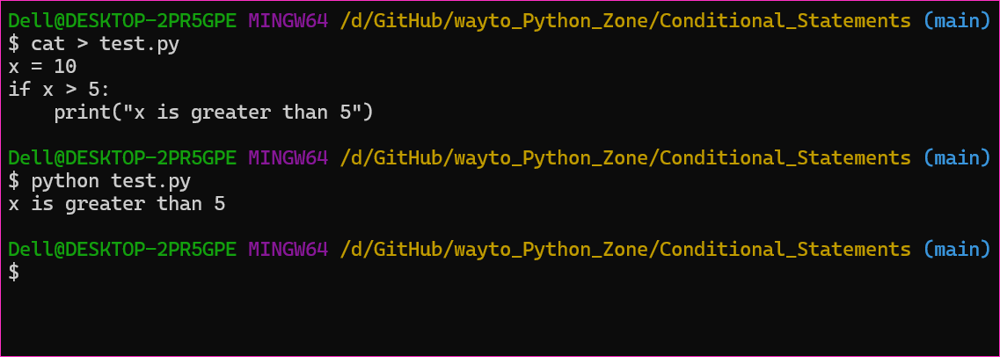
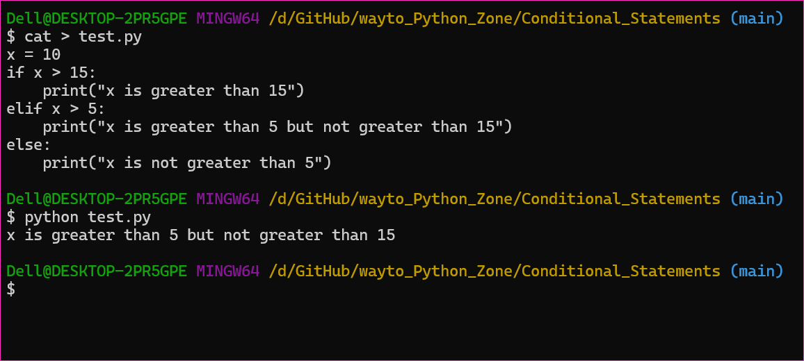

Conditional Statements in Python
--------------------------------
* Conditional statements are a fundamental part of programming that allow you to make decisions and execute different blocks of code based on certain conditions. 
* In Python, you can use `if`, `elif` (short for "else if"), and `else` to create conditional statements.

`if` Statement
--------------
* The `if` statement is used to execute a block of code if a specified condition is `True`. If the condition is `False`, the code block is skipped.
```py
if condition:
    # Code to execute if the condition is True
```

* Example:
```py
x = 10
if x > 5:
    print("x is greater than 5")
```


`elif` Statement
----------------
* The `elif` statement allows you to check additional conditions if the previous `if` or `elif` conditions are `False`. You can have multiple `elif` statements after the initial `if` statement.
```py
if condition1:
    # Code to execute if condition1 is True
elif condition2:
    # Code to execute if condition2 is True
elif condition3:
    # Code to execute if condition3 is True
# ...
else:
    # Code to execute if none of the conditions are True
```

* Example:
```py
x = 10
if x > 15:
    print("x is greater than 15")
elif x > 5:
    print("x is greater than 5 but not greater than 15")
else:
    print("x is not greater than 5")
```


`else` Statement
----------------
* The `else` statement is used to specify a block of code to execute when none of the previous conditions (in the `if` and `elif` statements) are `True`.
```py
if condition:
    # Code to execute if the condition is True
else:
    # Code to execute if the condition is False
```

* Example:
```py
x = 3
if x > 5:
    print("x is greater than 5")
else:
    print("x is not greater than 5")
```
