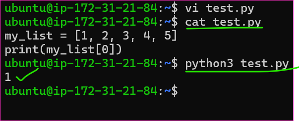
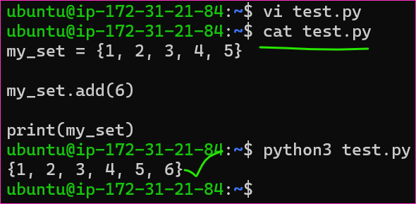
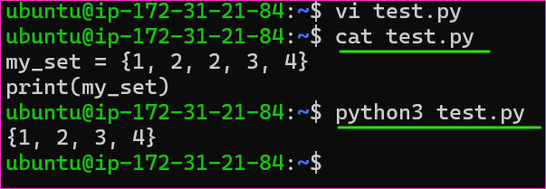
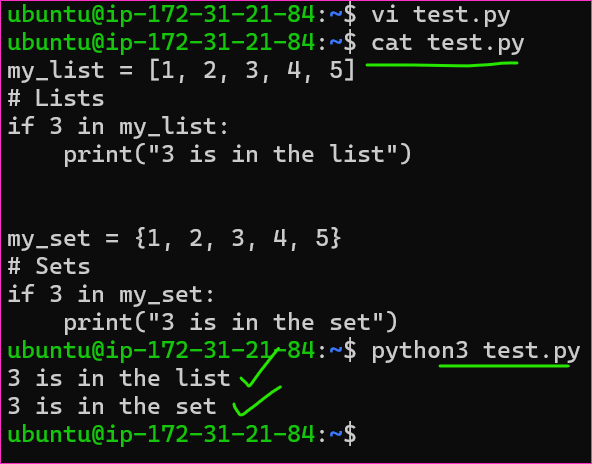

Lists vs. Sets
--------------

### Lists
* Ordered Collection:
* Lists are ordered collections of elements. The order in which elements are added is preserved.
* Elements can be accessed by their index.
```py
my_list = [1, 2, 3, 4, 5]
print(my_list[0])  # Output: 1
```


### Mutable
* Lists are mutable, meaning you can modify their elements after creation.
```py
my_list[1] = 10
```

### Allows Duplicate Elements:
* Lists can contain duplicate elements.
```py
my_list = [1, 2, 2, 3, 4]
```

### Use Cases:
* Use lists when you need an ordered collection with the ability to modify elements.


Sets
------
### Unordered Collection:
* Sets are unordered collections of unique elements. The order in which elements are added is not preserved.
* Elements cannot be accessed by their index.
```py
my_set = {1, 2, 3, 4, 5}
```

### Mutable:
* Sets are mutable, meaning you can add and remove elements after creation.
```py
my_set.add(6)
```

```py
my_set = {1, 2, 3, 4, 5}
my_set.add(6)
print(my_set)
```


### No Duplicate Elements:
* Sets do not allow duplicate elements. If you try to add a duplicate, it won't raise an error, but the set won't change.
```py
my_set = {1, 2, 2, 3, 4}  # Results in {1, 2, 3, 4}
```



### Use Cases:
* Use sets when you need an unordered collection of unique elements, and you want to perform set operations like union, intersection, and difference.

Common Operations:
------------------
### Adding Elements:
* Lists use `append()` or `insert()` methods.
* Sets use `add()` method.

### Removing Elements:
* Lists use `remove()`, `pop()`, or `del` statement.
Sets use `remove()` or `discard()` methods.

### Checking Membership:
* Lists use the `in` operator.
* Sets use the `in` operator as well, which is more efficient for sets.
```py
my_list = [1, 2, 3, 4, 5]
# Lists
if 3 in my_list:
    print("3 is in the list")


my_set = {1, 2, 3, 4, 5}
# Sets
if 3 in my_set:
    print("3 is in the set")
```



Choosing Between Lists and Sets
-------------------------------
### Use Lists When:
* You need to maintain the order of elements.
* Duplicate elements are allowed.
* You need to access elements by index.

### Use Sets When:
* Order doesn't matter.
* You want to ensure unique elements.
* You need to perform set operations like union, intersection, or difference.