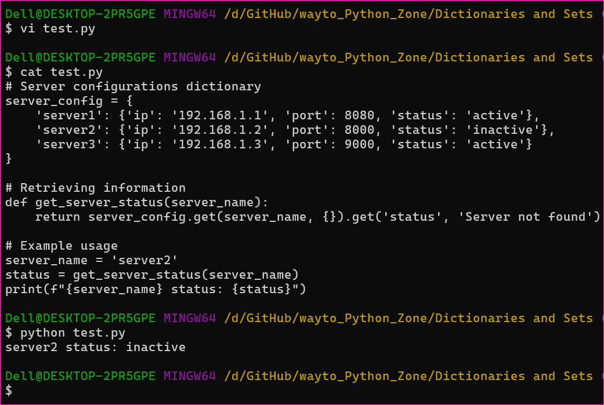

Practice Exercises and Examples
--------------------------------

### Example: Managing a Dictionary of Server Configurations and Optimizing Retrieval
* Scenario:
    * Suppose you are managing server configurations using a dictionary.
```py
server_config = {
    'server1': {'ip': '192.168.1.1', 'port': 8080, 'status': 'active'},
    'server2': {'ip': '192.168.1.2', 'port': 8000, 'status': 'inactive'},
    'server3': {'ip': '192.168.1.3', 'port': 9000, 'status': 'active'}
}
```

* Function for Retrieval:
```py
def get_server_status(server_name):
    return server_config.get(server_name, {}).get('status', 'Server not found')
```

* Example Usage:
```py
server_name = 'server2'
status = get_server_status(server_name)
print(f"{server_name} status: {status}")
```

* [Refer Here](https://github.com/aarkay-gummadi/wayto_Python_Zone/blob/main/Dictionaries%20and%20Sets/practicals.py) for the code of practicals.py

 
 
* In this example, the function `get_server_status` optimizes the retrieval of the server status by using the `get` method and providing a default value if the server name is not found.