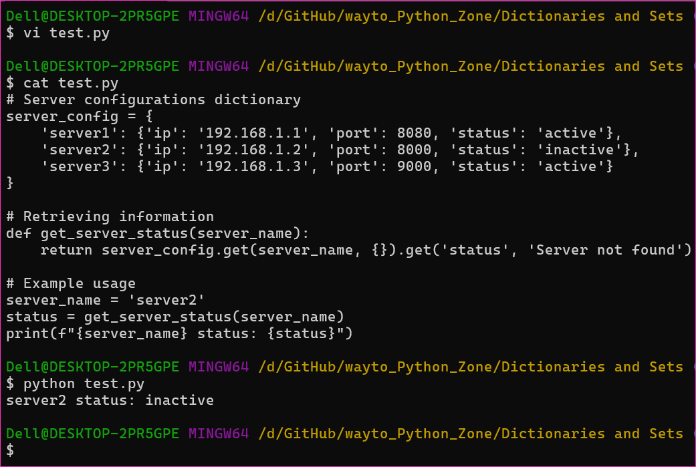
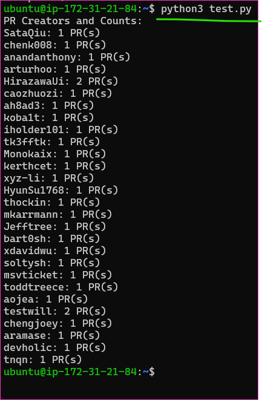

Sets and Set Operations
------------------------

* Overview:
    * A set in Python is an unordered collection of unique elements. 
    * It is useful for mathematical operations like union, intersection, and difference.

* Creating a Set:
```py
my_set = {1, 2, 3, 4, 5}
```

* Adding and Removing Elements:
```py
my_set.add(6)  # Adding an element
my_set.remove(3)  # Removing an element
```

* Set Operations:
```py
set1 = {1, 2, 3, 4}
set2 = {3, 4, 5, 6}

union_set = set1.union(set2)  # Union of sets
intersection_set = set1.intersection(set2)  # Intersection of sets
difference_set = set1.difference(set2)  # Difference of sets
```

* Subset and Superset:
```py
is_subset = set1.issubset(set2)  # Checking if set1 is a subset of set2
is_superset = set1.issuperset(set2)  # Checking if set1 is a superset of set2
```

Practice Exercises and Examples
-------------------------------

* Example: Managing a Dictionary of Server Configurations and Optimizing Retrieval

### Scenario:
* Suppose you are managing server configurations using a dictionary.
```py
server_config = {
    'server1': {'ip': '192.168.1.1', 'port': 8080, 'status': 'active'},
    'server2': {'ip': '192.168.1.2', 'port': 8000, 'status': 'inactive'},
    'server3': {'ip': '192.168.1.3', 'port': 9000, 'status': 'active'}
}
```

* Function for Retrieval:
```py
def get_server_status(server_name):
    return server_config.get(server_name, {}).get('status', 'Server not found')
```

* Example Usage:
```py
server_name = 'server2'
status = get_server_status(server_name)
print(f"{server_name} status: {status}")
```

* [Refer Here](https://github.com/aarkay-gummadi/wayto_Python_Zone/blob/main/Dictionaries%20and%20Sets/practicals.py) for the code of practicals.py



* [Refer Here](https://github.com/aarkay-gummadi/wayto_Python_Zone/blob/main/Dictionaries%20and%20Sets/demo-github-integration.py) for the code of github-integration.py
