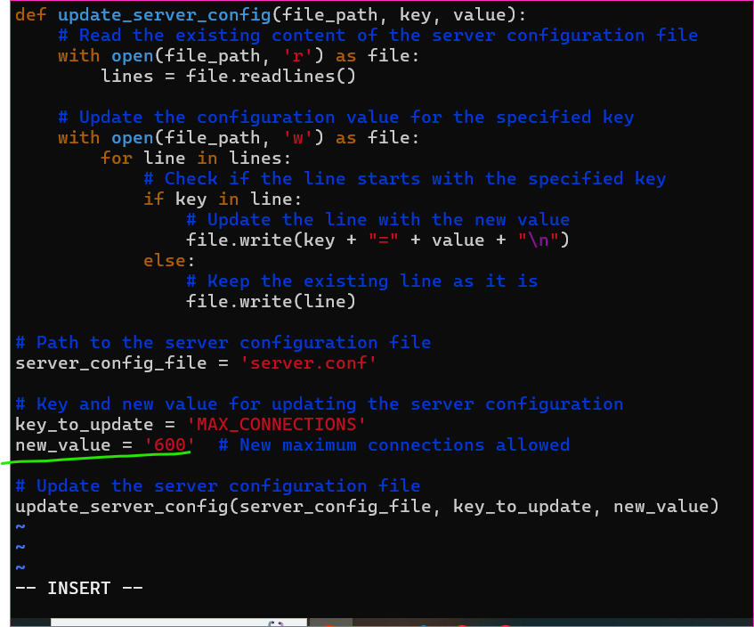
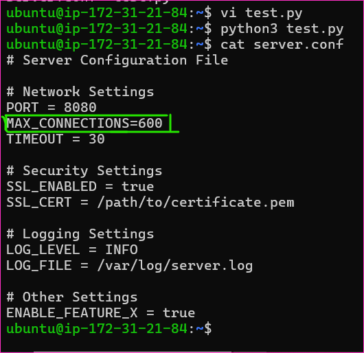
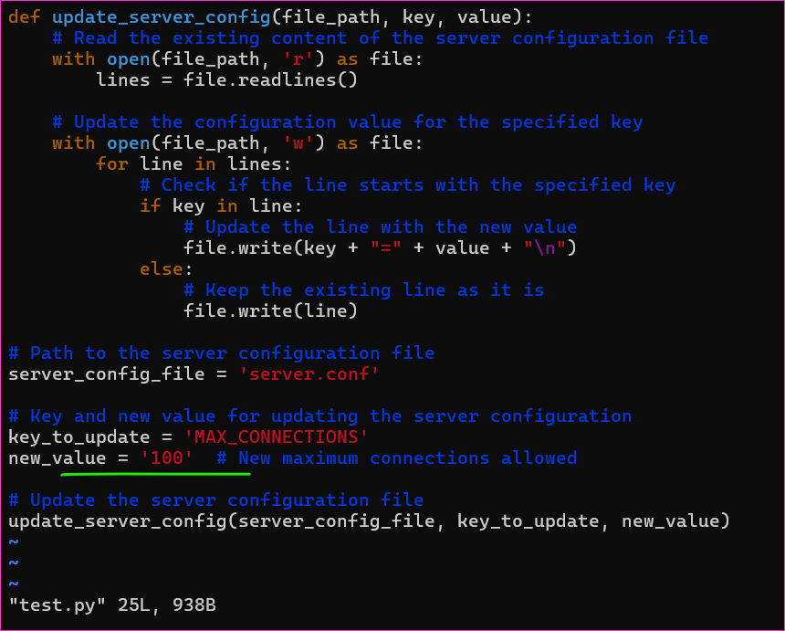
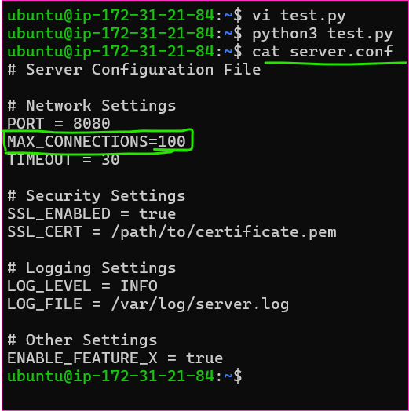
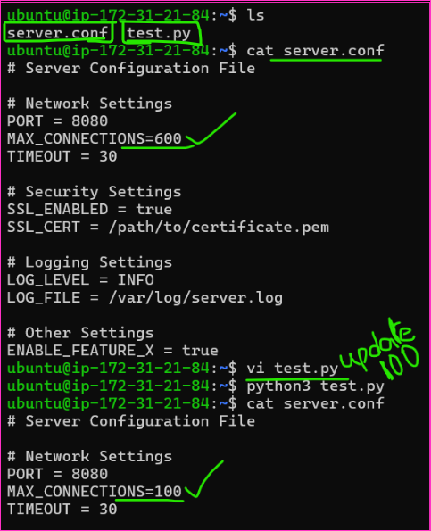

* [Refer Here](https://github.com/aarkay-gummadi/wayto_Python_Zone/blob/main/File_Operations/update_server.py) for the code of update_server.py

* To change the new_value is 600 to 100 for `update` it reflects in the server.conf file.

 Thanks for Reading!