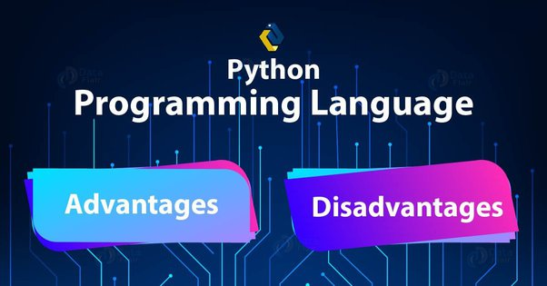

Advantages of Python
--------------------

### Easy to Read and Learn
* Python's high-level syntax is simple and resembles English.
* It doesn't require semicolons or branches, making it beginner-friendly.
* Maintenance costs are low due to its readability.

### Dynamic Typing
* Variables in Python are dynamically typed.
* No need for explicit variable declaration; types are assigned automatically during runtime.

### Free and Open Source
* Python is freely available and open source.
* You can modify and distribute the source code without restrictions.

### Portability
* Write Once, Run Anywhere (WORA) principle.
* Code written on one OS (e.g., Windows) can run on others (Linux, Mac) with minimal changes.

### Extensive Libraries
* Python has a rich ecosystem of libraries (e.g. NumPy, Pandas, Django).
These libraries simplify complex tasks and enhance productivity.

### Wide Range of Applications
* Web development, data science, automation, AI, and more.
* Preferred by professionals in engineering, mathematics, and science.

### Integration with Other Languages
* Python can extend to languages like C, C++, and Java.
* Cross-platform development and leveraging language strengths.

### Interpreted Language
* Code executes line by line, allowing easy debugging.
* Error traces provide informative feedback.

Disadvantages of Python
------------------------

### Slower Execution Speed
* Python is an interpreted language, which can be slower than compiled languages.
* Critical for performance-intensive applications.

### Higher Memory Consumption
* Python’s dynamic typing and garbage collection lead to higher memory usage.
* Not ideal for memory-constrained environments.

### Rare Mobile Applications
* Python isn’t commonly used for mobile app development.
* Native app development often relies on other languages.

### Limited for Game Development
* While possible, Python isn’t the primary choice for game development.
* Performance requirements favor languages like C++.