Interview Questions (Beginner and Intermediate)
-------------------------------------------------

### Describe a real-world example of how you used Python to solve a DevOps challenge.
* Here you can talk about the projects that we did in this series
    * GitHub Webhooks
    * JIRA integration
    * File Operations
    * 
### Discuss the challenges that you faced while using Python for DevOps and how did you overcome it.
* Here you can mention about a challenge that you faced while implementating a Python project for DevOps that we learnt.

### How can you secure your Python code and scripts?
* Handle any sensetive information using Input variables, command line arguments or env vars.

### Explain the difference between mutable and immutable objects.
* In Python, mutable objects can be altered after creation, while immutable objects cannot be changed once created. For instance:

* Mutable objects like lists can be modified:
```py
my_list = [1, 2, 3]
my_list[0] = 0  # Modifying an element in the list
print(my_list)  # Output: [0, 2, 3]
```
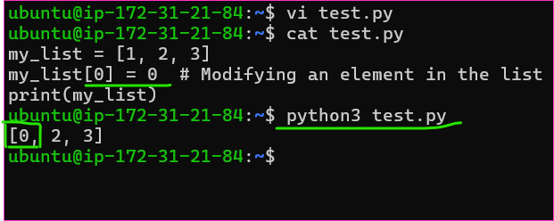

* Immutable objects like tuples cannot be altered:
```py
my_tuple = (1, 2, 3)
# Attempting to change a tuple will result in an error
# my_tuple[0] = 0
```
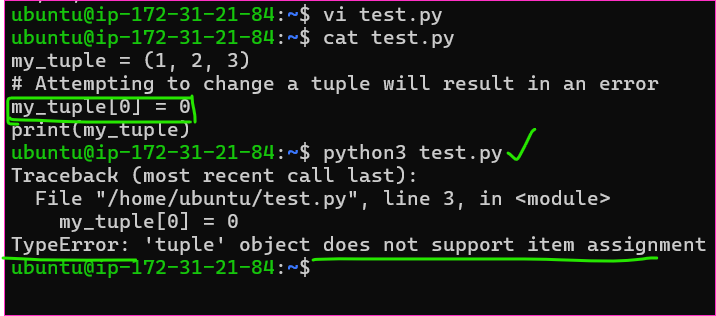

### Differentiate between list and tuple in Python.
* Lists are mutable and typically used for storing collections of items that can be changed, while tuples are immutable and commonly used to store collections of items that shouldn't change. Examples:

* List:
```py
my_list = [1, 2, 3]
my_list.append(4)  # Modifying by adding an element
print(my_list)  # Output: [1, 2, 3, 4]
```
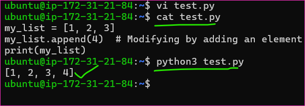

* Tuple:
```py
my_tuple = (1, 2, 3)
# Attempting to modify a tuple will result in an error
# my_tuple.append(4)
```

### Explain the use of virtualenv.
* Virtualenv creates isolated Python environments, allowing different projects to use different versions of packages without conflicts. Example:

* Creating a virtual environment:

### Creating a virtual environment named 'myenv'
* virtualenv myenv

* Activating the virtual environment:

### On Windows
```py
myenv\Scripts\activate
```

### On Unix or MacOS
```py
source myenv/bin/activate
```

### What are decorators in Python?
* Decorators modify the behavior of functions. They take a function as an argument, add some functionality, and return another function without modifying the original function's code. Example:

* Defining a simple decorator:
```py
def my_decorator(func):
    def wrapper():
        print("Something is happening before the function is called.")
        func()
        print("Something is happening after the function is called.")
    return wrapper

@my_decorator
def say_hello():
    print("Hello!")

say_hello()
```
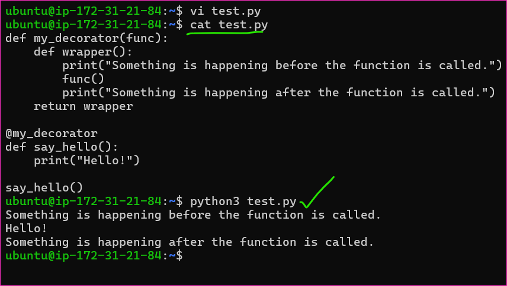

### How does exception handling work in Python?
* Exception handling in Python uses try, except, else, and finally blocks. Example:

* Handling division by zero exception:
```py
try:
    result = 10 / 0
except ZeroDivisionError:
    print("Division by zero is not allowed.")
else:
    print("Division successful:", result)
finally:
    print("Execution completed.")
```
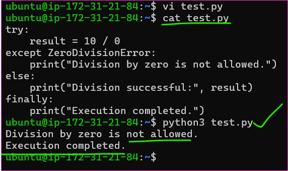

### What's the difference between append() and extend() for lists?
* append() adds a single element to the end of a list, while extend() adds multiple elements by appending elements from an iterable. * Example:

* Using append():
```py
my_list = [1, 2, 3]
my_list.append(4)
print(my_list)  # Output: [1, 2, 3, 4]
```
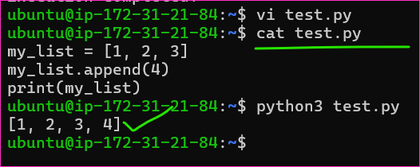

* Using extend():
```py
my_list = [1, 2, 3]
my_list.extend([4, 5])
print(my_list)  # Output: [1, 2, 3, 4, 5]
```
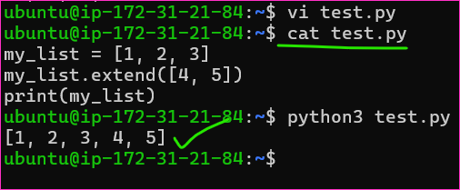

### Explain the use of lambda functions in Python.
* Lambda functions are anonymous functions used for short tasks. Example:

* Defining and using a lambda function:
```py
square = lambda x: x**2
print(square(5))  # Output: 25
```
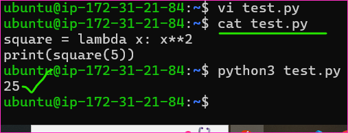

### What are the different types of loops in Python?
* Python has for loops and while loops.

* Example:

* Using for loop:
```py
for i in range(5):
    print(i)
```
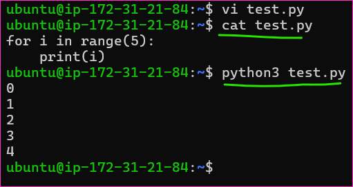

* Using while loop:
```py
i = 0
while i < 5:
    print(i)
    i += 1
```
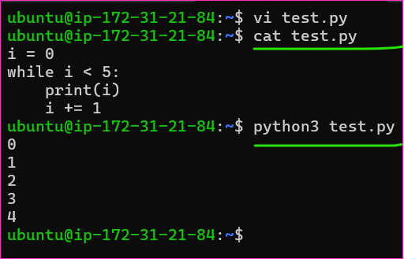

### Explain the difference between == and is operators.
* The == operator compares the values of two objects, while the is operator checks if two variables point to the same object in memory.

* Example:

* Using ==:
```py
a = [1, 2, 3]
b = [1, 2, 3]
print(a == b)  # Output: True (because values are equal)
```
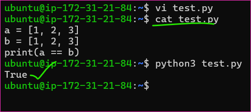

* Using is:
```py
a = [1, 2, 3]
b = a
print(a is b)  # Output: True (because they reference the same object)
```
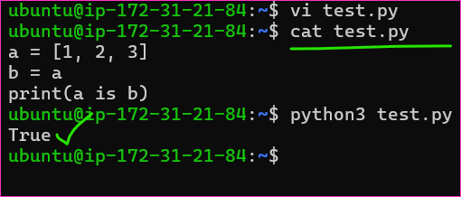

### What is the use of the pass keyword?
* The pass keyword is a no-operation placeholder used when a statement is syntactically needed but no action is required. Example:

* Using pass:
```py
def placeholder_function():
    pass  # To be implemented later
```

### What is the difference between global and local variables?
* Global variables are defined outside functions and can be accessed anywhere in the code, while local variables are defined inside functions and are only accessible within that function's scope. Example:

* Using a global variable:
```py
global_var = 10

def my_function():
    print(global_var)

my_function()  # Output: 10
```
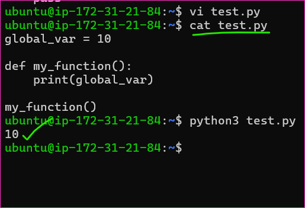

* Using a local variable:
```py
def my_function():
    local_var = 5
    print(local_var)

my_function()  # Output: 5
# Attempting to access local_var outside the function will result in an error
```
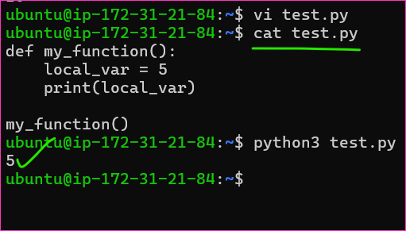

### Explain the difference between open() and with open() statement.
* open() is a built-in function used to open a file and return a file object. 
* However, it's crucial to manually close the file using file_object.close(). 
* Conversely, with open() is a context manager that automatically handles file closure, ensuring clean-up even if exceptions occur.

* Example:
```py
file = open('example.txt', 'r')
content = file.read()
file.close()
```
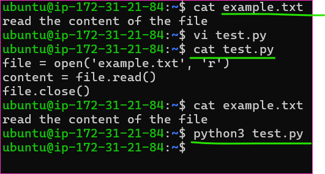

* Using with open():
```py
with open('example.txt', 'r') as file:
    content = file.read()
# File is automatically closed when the block exits
```
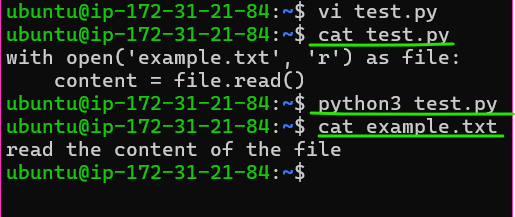