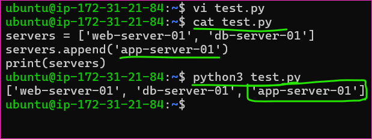

Basic-Level List Questions
-----------------------------

### What is a list in Python, and how is it used in DevOps?
* A list in Python is a collection of ordered and mutable elements. 
* In DevOps, lists are often used to manage and manipulate data, such as configurations, server names, and deployment targets. 
* For example, you can use a list to store a list of servers that need to be provisioned or configured.


### How do you create a list in Python, and can you provide an example related to DevOps?
* In Python, you create a list using square brackets `[]`. Here's an example related to DevOps:
```py
servers = ['web-server-01', 'db-server-01', 'app-server-01']
```

### What is the difference between a list and a tuple in Python, and when would you choose one over the other in a DevOps context?
* The key difference is mutability; lists are mutable, while tuples are immutable. 
* In DevOps, if you need a collection of items that won't change (e.g., server configurations, deployment steps), you would use a tuple. 
* If the data can change (e.g., a list of active servers, configuration settings that may be updated), you would use a list.

### How can you access elements in a list, and provide a DevOps-related example?
* You can access elements in a list by using their index. 
* In a DevOps context, if you have a list of server names and want to access the first server, you would do the following:
```py
servers = ['web-server-01', 'db-server-01', 'app-server-01']
first_server = servers[0]
print(first_server)
```


### How do you add an element to the end of a list in Python? Provide a DevOps example.
* You can add an element to the end of a list using the append() method. 
* In DevOps, if you want to add a new server to a list of servers, you can do this:
```py
servers = ['web-server-01', 'db-server-01']
servers.append('app-server-01')
print(servers)
```


### How can you remove an element from a list in Python, and can you provide a DevOps use case?
* You can remove an element from a list using the remove() method. 
* In a DevOps use case, you might want to remove a server from a list of servers that are no longer needed:
```py
servers = ['web-server-01', 'db-server-01', 'app-server-01']
servers.remove('db-server-01')
print(servers)
```
