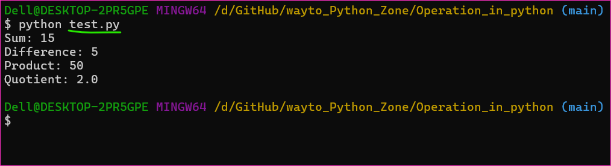
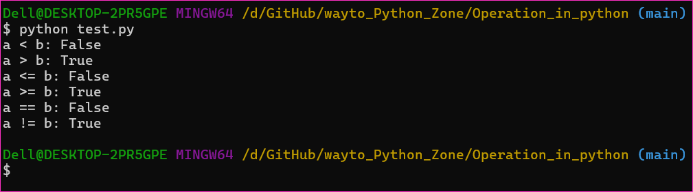
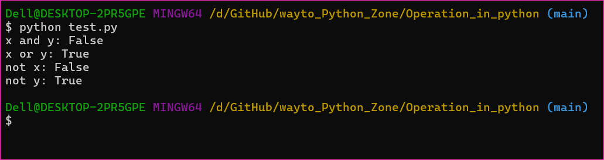
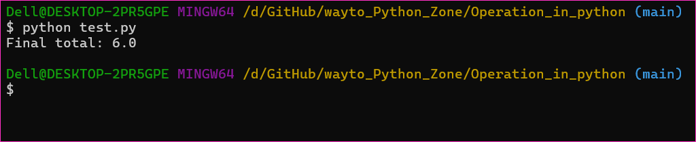
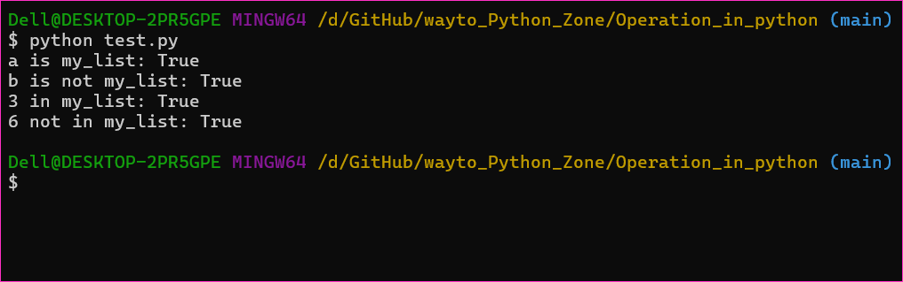

Python Operators Assignment
------------------------------

* In this assignment, you will explore various Python operators and their usage. 
* Please complete the following tasks.

### Task 1: Arithmetic Operators
* Create two variables a and b with numeric values.
* Calculate the sum, difference, product, and quotient of a and b.
* Print the results.
```py
a = 10
b = 5

sum_result = a + b
difference_result = a - b
product_result = a * b
quotient_result = a / b

print("Sum:", sum_result)
print("Difference:", difference_result)
print("Product:", product_result)
print("Quotient:", quotient_result)
```


### Task 2: Comparison Operators
* Compare the values of a and b using the following comparison operators: <, >, <=, >=, ==, and !=.
* Print the results of each comparison.
```py
a = 10
b = 5

less_than = a < b
greater_than = a > b
less_than_or_equal = a <= b
greater_than_or_equal = a >= b
equal = a == b
not_equal = a != b

print("a < b:", less_than)
print("a > b:", greater_than)
print("a <= b:", less_than_or_equal)
print("a >= b:", greater_than_or_equal)
print("a == b:", equal)
print("a != b:", not_equal)
```


### Task 3: Logical Operators
* Create two boolean variables, x and y.
* Use logical operators (and, or, not) to perform various logical operations on x and y.
* Print the results.
```py
x = True
y = False

and_result = x and y
or_result = x or y
not_result_x = not x
not_result_y = not y

print("x and y:", and_result)
print("x or y:", or_result)
print("not x:", not_result_x)
print("not y:", not_result_y)
```


### Task 4: Assignment Operators
* Create a variable total and initialize it to 10.
* Use assignment operators (+=, -=, *=, /=) to update the value of total.
* Print the final value of total.
```py
total = 10

total += 5
total -= 3
total *= 2
total /= 4

print("Final total:", total)
```


### Task 5: Bitwise Operators (Optional)
* If you are comfortable with bitwise operators, perform some bitwise operations on integer values and print the results. If not, you can skip this task.
```py
my_list = [1, 2, 3, 4, 5]

# Identity operators
a = my_list
b = [1, 2, 3, 4, 5]

is_same_object = a is my_list
is_not_same_object = b is not my_list

# Membership operators
element_in_list = 3 in my_list
element_not_in_list = 6 not in my_list

print("a is my_list:", is_same_object)
print("b is not my_list:", is_not_same_object)
print("3 in my_list:", element_in_list)
print("6 not in my_list:", element_not_in_list)
```


### Task 6: Identity and Membership Operators
* Create a list my_list containing a few elements.
* Use identity operators (is and is not) to check if two variables are the same object.
* Use membership operators (in and not in) to check if an element is present in my_list.
* Print the results.