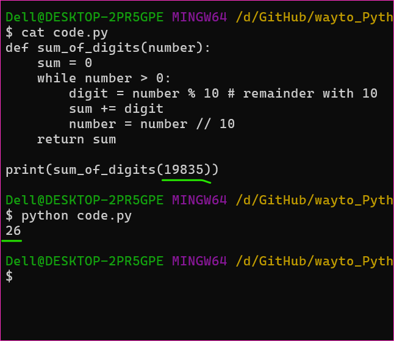

Different types of Applications
--------------------------------
* Standalone Applications and Client side Applications
    * Command line Application
    * Desktop Application
    * Mobile Apps
* Server Side Applications
    * Web Applications
    * Web APIs
* Integrations
    * Message Queues
    * Publisher and Subscriber

Scope of our discussion in Python
---------------------------------
* Writing logic
* building CLI and APIs in Python
* Leveraging cloud to build decent applications (Serverless)
* Persistence using  
    * Relational Database
    * NOSQL Database
* Integrations

Story of our Programming journey
---------------------------------
* Our Friend Ishika

### Introduction of our communication
* Ishika can remember values, but you have to tell to remember by giving a name and value
```
Remember hyderabad with alias/name city
```
* Ishika knows how to 
    * add +
    * sub -
    * mul *
    * div /
    * remainder(modules) %

* To make ishika add numbers
```
Hi ishika
Remember 2 as num1
Remember 4 as num2
add num1 and num2 and tell me result
```
* Ishika executes what you said sentence by sentence

* Lets make ishika multiply numbers
```
Hi ishika
Remember 2 as num1

Add num1, num1 and remember result in result
Add result, num1 and remember result
```

* Lets try to make ishika tell if the number is even or odd (+ - * / %)
```
Remember 21 as number
perform number % 2 and store result
if result is zero say even else odd
```

* Lets add sum of all numbers `369` => 3 + 6 + 9. Ishika knows `+ - * / %`
```
Hi ishika
Remember 369 as number
calculate number % 10 and store in value1 (369%10 = 9 => )
calculate number / 10 and store in number
calculate number % 10 and store in value2 (369%10 = 6 => )
calculate number / 10 and store in number
now add number, value1 and value2
```

* Lets make ishika calculate sum of any number
```
Hi ishika
Rember 3691 as number
until number not equals 0 try below steps
    calculate number%10 and add it to sum
    calculate number/10 and assign it to number
end until
say sum
```

* I have 100000 rupees and i gave it for intrest for 24 % what will be the total amount after 3 years
```
si = p * t * r/100
   = 100000 * 3 * 24 /100
   = 72000
p = 100000
total = 172000
```

* Exercise: I have invested 10 lakhs in a mutual fund which gave 12% returns. I have invested 10 lakhs whan i was 24 years old now i'm 60 what is the total amount. [Refer Here](https://groww.in/calculators/lumpsum-calculator). Find the formula for lumpsum returns calculation.


* Operators:
    * Assignment: `number = number%10` => calculate number mod 10 and assign it to number
    * equals `=`
    * not equals `!=`
    * greater than lt, lte, gte `> < <= >=`


Debugging
---------
* consider the below conversation
```
Hi ishika
Rember 19835 as number
Remember 0 as sum
until number not equals 0 try below steps
    calculate number%10 and add it to sum
    calculate number/10 and assign it to number
end until
say sum
```
* For the code [Refer Here](https://github.com/aarkay-gummadi/wayto_Python_Zone/blob/main/Python_khajasir_16042024/code.py)



### References
* Project Euler [Refer Here](https://projecteuler.net/archives)
* Hacker Rank [Refer Here](https://www.hackerrank.com/)