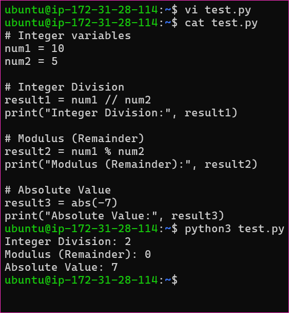
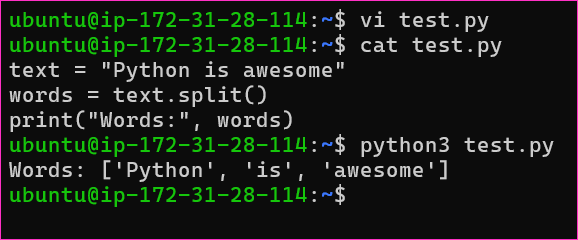

Introduction to Python, Installation, and Configuration
---------------------------------------------------------
* Introduction to Python and its role in DevOps.
* Installing Python and setting up a development environment.
* Writing your first Python program.

* Certainly! The choice between using shell scripting and Python in DevOps depends on the specific task or problem you're trying to solve. Both have their strengths and are suitable for different scenarios. Here are some guidelines to help you decide when to use each:

### Use Shell Scripting When

* System Administration Tasks: Shell scripting is excellent for automating routine system administration tasks like managing files, directories, and processes. You can use shell scripts for tasks like starting/stopping services, managing users, and basic file manipulation.

* Command Line Interactions: If your task primarily involves running command line tools and utilities, shell scripting can be more efficient. It's easy to call and control these utilities from a shell script.

* Rapid Prototyping: If you need to quickly prototype a solution or perform one-off tasks, shell scripting is usually faster to write and execute. It's great for ad-hoc tasks.

* Text Processing: Shell scripting is well-suited for tasks that involve text manipulation, such as parsing log files, searching and replacing text, or extracting data from text-based sources.

* Environment Variables and Configuration: Shell scripts are useful for managing environment variables and configuring your system.

### Use Python When
* Complex Logic: Python is a full-fledged programming language and is well-suited for tasks that involve complex logic, data structures, and algorithms. If your task requires extensive data manipulation, Python can be a more powerful choice.

* Cross-Platform Compatibility: Python is more platform-independent than shell scripting, making it a better choice for tasks that need to run on different operating systems.

* API Integration: Python has extensive libraries and modules for interacting with APIs, databases, and web services. If your task involves working with APIs, Python may be a better choice.

* Reusable Code: If you plan to reuse your code or build larger applications, Python's structure and modularity make it easier to manage and maintain.

* Error Handling: Python provides better error handling and debugging capabilities, which can be valuable in DevOps where reliability is crucial.

* Advanced Data Processing: If your task involves advanced data processing, data analysis, or machine learning, Python's rich ecosystem of libraries (e.g., Pandas, NumPy, SciPy) makes it a more suitable choice.

### Data Types
* In programming, a data type is a classification or categorization that specifies which type of value a variable can hold. Data types are essential because they determine how data is stored in memory and what operations can be performed on that data. Python, like many programming languages, supports several built-in data types. Here are some of the common data types in Python:

* Numeric Data Types:

    * int: Represents integers (whole numbers). Example: x = 5
    * float: Represents floating-point numbers (numbers with decimal points). Example: y = 3.14
    * complex: Represents complex numbers. Example: z = 2 + 3j

* Sequence Types:

    * str: Represents strings (sequences of characters). Example: text = "Hello, World"
    * list: Represents lists (ordered, mutable sequences). Example: my_list = [1, 2, 3]
    * tuple: Represents tuples (ordered, immutable sequences). Example: my_tuple = (1, 2, 3)

* Mapping Type:

    * dict: Represents dictionaries (key-value pairs). Example: my_dict = {'name': 'John', 'age': 30}

* Set Types:

    * set: Represents sets (unordered collections of unique elements). Example: my_set = {1, 2, 3}
    * frozenset: Represents immutable sets. Example: my_frozenset = frozenset([1, 2, 3])

* Boolean Type:

    * bool: Represents Boolean values (True or False). Example: is_valid = True

* Binary Types:

    * bytes: Represents immutable sequences of bytes. Example: data = b'Hello'
    * bytearray: Represents mutable sequences of bytes. Example: data = bytearray(b'Hello')

* None Type:

    * NoneType: Represents the None object, which is used to indicate the absence of a value or a null value.

* Custom Data Types:

    * You can also define your custom data types using classes and objects.

### Strings

* String Data Type in Python:

    * In Python, a string is a sequence of characters, enclosed within single (' '), double (" "), or triple (''' ''' or """ """) quotes.
    * Strings are immutable, meaning you cannot change the characters within a string directly. Instead, you create new strings.
    * You can access individual characters in a string using indexing, e.g., my_string[0] will give you the first character.
    * Strings support various built-in methods, such as len(), upper(), lower(), strip(), replace(), and more, for manipulation.


* String Manipulation and Formatting:

    * Concatenation: You can combine strings using the + operator.
    * Substrings: Use slicing to extract portions of a string, e.g., my_string[2:5] will extract characters from the 2nd to the 4th position.
    * String interpolation: Python supports various ways to format strings, including f-strings (f"...{variable}..."), %-formatting ("%s %d" % ("string", 42)), and str.format().
    * Escape sequences: Special characters like newline (\n), tab (\t), and others are represented using escape sequences.
    * String methods: Python provides many built-in methods for string manipulation, such as split(), join(), and startswith().

### Numberic Data Type

* Numeric Data Types in Python (int, float):

    * Python supports two primary numeric data types: int for integers and float for floating-point numbers.
    * Integers are whole numbers, and floats can represent both whole and fractional numbers.
    * You can perform arithmetic operations on these types, including addition, subtraction, multiplication, division, and more.
    * Be aware of potential issues with floating-point precision, which can lead to small inaccuracies in calculations.
    * Python also provides built-in functions for mathematical operations, such as abs(), round(), and math module for advanced functions.

### Regex

*  Regular Expressions for Text Processing:

    * Regular expressions (regex or regexp) are a powerful tool for pattern matching and text processing.
    * The re module in Python is used for working with regular expressions.
    * Common metacharacters: . (any character), * (zero or more), + (one or more), ? (zero or one), [] (character class), | (OR), ^ (start of a line), $ (end of a line), etc.
    * Examples of regex usage: matching emails, phone numbers, or extracting data from text.
    * re module functions include re.match(), re.search(), re.findall(), and re.sub() for pattern matching and replacement.


Keywords in Python
-------------------

* Keywords are reserved words in Python that have predefined meanings and cannot be used as variable names or identifiers. These words are used to define the structure and logic of the program. They are an integral part of the Python language and are case-sensitive, which means you must use them exactly as specified.

#### Here are some important Python keywords:

* and: It is a logical operator that returns True if both operands are true.

* or: It is a logical operator that returns True if at least one of the operands is true.

* not: It is a logical operator that returns the opposite of the operand's truth value.

* if: It is used to start a conditional statement and is followed by a condition that determines whether the code block is executed.

* else: It is used in conjunction with if to define an alternative code block to execute when the if condition is False.

* elif: Short for "else if," it is used to check additional conditions after an if statement and is used in combination with if and else.

* while: It is used to create a loop that repeatedly executes a block of code as long as a specified condition is true.

* for: It is used to create a loop that iterates over a sequence (such as a list, tuple, or string) and executes a block of code for each item in the sequence.

* in: Used with for, it checks if a value is present in a sequence.

* try: It is the beginning of a block of code that is subject to exception handling. It is followed by except to catch and handle exceptions.

* except: Used with try, it defines a block of code to execute when an exception is raised in the corresponding try block.

* finally: Used with try, it defines a block of code that is always executed, whether an exception is raised or not.

* def: It is used to define a function in Python.

* return: It is used within a function to specify the value that the function should return.

* class: It is used to define a class, which is a blueprint for creating objects in object-oriented programming.

* import: It is used to import modules or libraries to access their functions, classes, or variables.

* from: Used with import to specify which specific components from a module should be imported.

* as: Used with import to create an alias for a module, making it easier to reference in the code.

* True: It represents a boolean value for "true."

* False: It represents a boolean value for "false."

* None: It represents a special null value or absence of value.

* is: It is used for identity comparison, checking if two variables refer to the same object in memory.

* lambda: It is used to create small, anonymous functions (lambda functions).

* with: It is used for context management, ensuring that certain operations are performed before and after a block of code.

* global: It is used to declare a global variable within a function's scope.

* nonlocal: It is used to declare a variable as nonlocal, which allows modifying a variable in an enclosing (but non-global) scope.


### Understanding Variables in Python

* In Python, a variable is a named storage location used to store data. Variables are essential for programming as they allow us to work with data, manipulate it, and make our code more flexible and reusable.

* Example:
```py
# Assigning a value to a variable
my_variable = 42

# Accessing the value of a variable
print(my_variable)  # Output: 42
```


#### Variable Scope and Lifetime

* Variable Scope: In Python, variables have different scopes, which determine where in the code the variable can be accessed. There are mainly two types of variable scopes:

* Local Scope: Variables defined within a function have local scope and are only accessible inside that function.
```py
def my_function():
    x = 10  # Local variable
    print(x)

my_function()
print(x)  # This will raise an error since 'x' is not defined outside the function.
```


* Global Scope: Variables defined outside of any function have global scope and can be accessed throughout the entire code.
```py
y = 20  # Global variable

def another_function():
    print(y)  # This will access the global variable 'y'

another_function()
print(y)  # This will print 20
```


* Variable Lifetime: The lifetime of a variable is determined by when it is created and when it is destroyed or goes out of scope. Local variables exist only while the function is being executed, while global variables exist for the entire duration of the program.

#### Variable Naming Conventions and Best Practices
* It's important to follow naming conventions and best practices for variables to write clean and maintainable code:

    * Variable names should be descriptive and indicate their purpose.
    * Use lowercase letters and separate words with underscores (snake_case) for variable names.
    * Avoid using reserved words (keywords) for variable names.
    * Choose meaningful names for variables.

* Example:
```py
# Good variable naming
user_name = "John"
total_items = 42

# Avoid using reserved words
class = "Python"  # Not recommended

# Use meaningful names
a = 10  # Less clear
num_of_students = 10  # More descriptive
```

#### Practice Exercises and Examples

* Example: Using Variables to Store and Manipulate Configuration Data in a DevOps Context

* In a DevOps context, you often need to manage configuration data for various services or environments. Variables are essential for this purpose. Let's consider a scenario where we need to store and manipulate configuration data for a web server.

```py
# Define configuration variables for a web server
server_name = "my_server"
port = 80
is_https_enabled = True
max_connections = 1000

# Print the configuration
print(f"Server Name: {server_name}")
print(f"Port: {port}")
print(f"HTTPS Enabled: {is_https_enabled}")
print(f"Max Connections: {max_connections}")

# Update configuration values
port = 443
is_https_enabled = False

# Print the updated configuration
print(f"Updated Port: {port}")
print(f"Updated HTTPS Enabled: {is_https_enabled}")
```


* In this example, we use variables to store and manipulate configuration data for a web server. This allows us to easily update and manage the server's configuration in a DevOps context.


Python Functions, Modules and Packages
--------------------------------------

### Differences Between Functions, Modules, and Packages

#### Functions

* A function in Python is a block of code that performs a specific task. Functions are defined using the def keyword and can take inputs, called arguments. They are a way to encapsulate and reuse code.

* Example:
```py
def greet(name):
    return f"Hello, {name}!"

message = greet("Alice")
print(message)
```


* In this example, greet is a function that takes a name argument and returns a greeting message.

#### Modules

* A module is a Python script containing Python code. It can define functions, classes, and variables that can be used in other Python scripts. Modules help organize and modularize your code, making it more maintainable.

* Example:

* Suppose you have a Python file named my_module.py:
```py
# my_module.py
def square(x):
    return x ** 2

pi = 3.14159265
```

* You can use this module in another script:
```py
import my_module

result = my_module.square(5)
print(result)
print(my_module.pi)
```

* In this case, my_module is a Python module containing the square function and a variable pi.

#### Packages

* A package is a collection of modules organized in directories. Packages help you organize related modules into a hierarchy. They contain a special file named __init__.py, which indicates that the directory should be treated as a package.

* Example:

* Suppose you have a package structure as follows:
```py
my_package/
    __init__.py
    module1.py
    module2.py
```

* You can use modules from this package as follows:
```py
from my_package import module1

result = module1.function_from_module1()
```

* In this example, my_package is a Python package containing modules module1 and module2.

### How to Import a Package

* Importing a package or module in Python is done using the import statement. You can import the entire package, specific modules, or individual functions/variables from a module.

* Example:
```py
# Import the entire module
import math

# Use functions/variables from the module
result = math.sqrt(16)
print(result)

# Import specific function/variable from a module
from math import pi
print(pi)
```

* In this example, we import the math module and then use functions and variables from it. You can also import specific elements from modules using the from module import element syntax.

### Python Workspaces

* Python workspaces refer to the environment in which you develop and run your Python code. They include the Python interpreter, installed libraries, and the current working directory. Understanding workspaces is essential for managing dependencies and code organization.

* Python workspaces can be local or virtual environments. A local environment is the system-wide Python installation, while a virtual environment is an isolated environment for a specific project. You can create virtual environments using tools like virtualenv or venv.

* Example:
```py
# Create a virtual environment
python -m venv myenv

# Activate the virtual environment (on Windows)
myenv\Scripts\activate

# Activate the virtual environment (on macOS/Linux)
source myenv/bin/activate
```

* Once activated, you work in an isolated workspace with its Python interpreter and library dependencies.


Introduction to Operators in Python
------------------------------------
* Operators in Python are special symbols or keywords that are used to perform operations on variables and values. 
* Python supports a wide range of operators, categorized into several types. 
* These operators allow you to perform tasks such as arithmetic calculations, assign values to variables, compare values, perform logical operations, and more.

* Here are the main types of operators in Python:

* Arithmetic Operators: These operators are used for performing basic mathematical operations such as addition, subtraction, multiplication, division, and more.

* Assignment Operators: Assignment operators are used to assign values to variables. They include the equal sign (=) and various compound assignment operators.

* Relational Operators: Relational operators are used to compare values and determine the relationship between them. They return a Boolean result (True or False).

* Logical Operators: Logical operators are used to combine and manipulate Boolean values. They include "and," "or," and "not."

* Identity Operators: Identity operators are used to check if two variables point to the same object in memory. 
* The identity operators in Python are "is" and "is not."

* Membership Operators: Membership operators are used to check if a value is present in a sequence or collection, such as a list, tuple, or string. 
* The membership operators in Python are "in" and "not in."

* Bitwise Operators: Bitwise operators are used to perform operations on individual bits of binary numbers. 
* They include bitwise AND, OR, XOR, and more.

* Precedence of Operations: Operators in Python have different levels of precedence, which determine the order in which operations are performed in an expression.

* [Refer Here](https://github.com/aarkay-gummadi/wayto_Python_Zone/blob/main/python%20codes/hello_world.py) for the basic hello-world code.


* [Refer Here](https://github.com/aarkay-gummadi/wayto_Python_Zone/blob/main/python%20codes/float.py) for the code float.py


* [Refer Here](https://github.com/aarkay-gummadi/wayto_Python_Zone/blob/main/python%20codes/int.py) for the code of int.py




* [Refer Here](https://github.com/aarkay-gummadi/wayto_Python_Zone/blob/main/Regex_codes/regex_findall.py) for the code of regex_findall


* [Refer Here](https://github.com/aarkay-gummadi/wayto_Python_Zone/blob/main/Regex_codes/regex_match.py) for the code of regex_match.py


* [Refer Here](https://github.com/aarkay-gummadi/wayto_Python_Zone/blob/main/Regex_codes/regex_replace.py) for the code of regex_replace.py


* [Refer Here](https://github.com/aarkay-gummadi/wayto_Python_Zone/blob/main/Regex_codes/regex_search.py) for the code of regex_search.py


* [Refer Here](https://github.com/aarkay-gummadi/wayto_Python_Zone/blob/main/Regex_codes/regex_split.py) for the code of regex_split.py


* [Refer Here](https://github.com/aarkay-gummadi/wayto_Python_Zone/blob/main/String_codes/string_concat.py) for the code of string_concat.py


* [Refer Here](https://github.com/aarkay-gummadi/wayto_Python_Zone/blob/main/String_codes/string_length.py) for the code of string_length.py


* [Refer Here](https://github.com/aarkay-gummadi/wayto_Python_Zone/blob/main/String_codes/string_lowercase.py) for the code of string_lowercase.py


* [Refer Here](https://github.com/aarkay-gummadi/wayto_Python_Zone/blob/main/String_codes/string_replace.py) for the code of string_replace.py


* [Refer Here](https://github.com/aarkay-gummadi/wayto_Python_Zone/blob/main/String_codes/string_split.py) for the code of string_split.py




* [Refer Here](https://github.com/aarkay-gummadi/wayto_Python_Zone/blob/main/String_codes/string_strip.py) for the code of string_strip.py


* [Refer Here](https://github.com/aarkay-gummadi/wayto_Python_Zone/blob/main/String_codes/string_substring.py) for the code of string_substring.py

